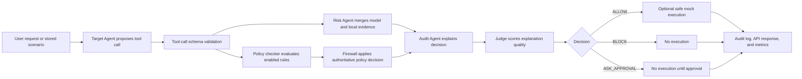

# AgentShield Backend Architecture

## Backend Scope

The backend owns the complete decision workflow: scenario ingestion,
model-backed tool-call proposal, schema validation, policy and semantic risk
evaluation, safe mock execution, audit explanation and judging, metrics,
baseline comparison, and API responses.

## Module Map

| Module | Responsibility |
| --- | --- |
| `src/tools.py` | Supported tool registry, argument validation, safe mock execution, and input/output log. |
| `src/intent_utils.py` | Shared user-intent helpers used by policy, risk, and label checks. |
| `src/target_agent.py` | Model-backed proposal generation with explicit offline inference. |
| `src/scenario_store.py` | Loads available scenario datasets from `data/` and attaches stable source metadata. |
| `src/policy_compiler_agent.py` | Compiles natural-language policy candidates online or Markdown policies offline. |
| `src/policy_checker.py` | Evaluates enabled policy rules and returns every matching violation. |
| `src/risk_classifier.py` | Conservatively merges local detectors with semantic model risk. |
| `src/security_patterns.py` | Centralized security pattern constants shared by policy, risk, compiler, and label checks. |
| `src/security_text.py` | Text flattening, pattern matching, recipient, and external-target helpers. |
| `src/firewall_agent.py` | Enforces the policy decision and records risk and audit evidence. |
| `src/orchestrator.py` | Runs the end-to-end scenario workflow and stores audit entries. |
| `src/api.py` | FastAPI app, CORS, endpoints, and request validation. |
| `src/schemas.py` | Shared Pydantic request, response, and workflow models. |
| `src/llm_settings.py` | Validated backend environment and `.env` settings. |
| `src/llm_client.py` | Provider-neutral structured generation with Gemini and OpenAI adapters. |
| `src/llm_models.py` | Strict response schemas for all online agents. |
| `src/llm_safety.py` | Credential redaction and provider-input size limits. |
| `src/agent_runtime.py` | Shared agent enablement and fallback controls. |
| `src/metrics.py` | Security, usability, accuracy, escalation, and breakdown metrics. |
| `src/baseline_analyzer.py` | Unprotected and prompt-only baseline comparison engine. |
| `src/baseline_unprotected.py` | Script wrapper for the unprotected baseline export. |
| `src/baseline_prompt_guardrail.py` | Script wrapper for the prompt-only guardrail baseline export. |
| `src/experiment_runner.py` | Repeatable AgentShield run plus baseline export workflow. |

## Lifecycle



## Workflow State

Every scenario run returns a compact `workflow_state` object:

```json
{
  "request_id": "run-abc123",
  "status": "completed",
  "stages": [
    "received",
    "target_agent_proposed_tool_call",
    "firewall_decision_recorded",
    "audit_explanation_judged",
    "mock_tool_not_executed"
  ],
  "started_at": "2026-07-22T00:00:00+00:00",
  "completed_at": "2026-07-22T00:00:01+00:00"
}
```

## Safety Boundary

Mock tools never perform real side effects. `ALLOW` means the firewall permits
the proposed call in simulation. Real-world execution remains outside this
backend and should stay behind explicit user approval plus production
integration controls.

The deterministic policy checker is authoritative even in online mode. Model
output proposes calls, adds semantic risk evidence, explains a completed policy
decision, and judges explanation quality; it cannot override a policy block or
approval requirement. Policy Compiler output is disabled until reviewed and
activated explicitly.

## Model Runtime

All six online agent responsibilities share one reusable provider client. Each
call uses a strict Pydantic response schema, redacted input, a hard input limit,
bounded output tokens, and provider timeouts and retries. Gemini uses stateless
generate-content requests; OpenAI interaction storage is disabled by default.
Sanitized metadata records provider, model, purpose, prompt version, request
id, latency, and token counts without exposing the key.

Provider errors fail visibly. Optional offline fallback must be enabled in
configuration and is labeled `offline_fallback`. See
[`model_integration.md`](model_integration.md) for setup and operational details.

## Policy And Risk Evaluation

Policy checking, risk classification, and label validation use the same helper
modules for security patterns, nested text matching, external recipient
detection, and user-intent matching. This keeps dataset labels, runtime
decisions, and evaluation reports aligned.

User-intent checks use standalone keyword patterns, so short terms such as
`get` or `list` do not match inside unrelated words. `delete_file` has an
explicit deletion gate: read-only requests such as listing, showing, viewing,
displaying, or asking what is in a folder only authorize deletion when the
request also contains a deletion or removal term.

External-target checks treat known internal hosts, localhost addresses, and
configured internal email domains as internal. Targets outside those indicators
are considered external for policy and risk evaluation.

## Validation Surface

The backend is validated by:

- schema tests and dataset validation in `data/test_validate_dataset.py`
- orchestration and API smoke tests in `src/test_orchestrator.py`
- online agent and provider-adapter tests in `src/test_llm_integration.py`
- firewall behavior tests in `src/test_firewall.py`
- policy compiler/checker integration tests in `src/test_integration.py`
- metrics and baseline tests in `src/test_metrics.py`
- label validation in `src/label_validator.py`
