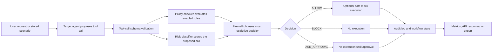

# AgentShield Backend Architecture

## Backend Scope

The backend owns the full local decision workflow: scenario ingestion, target
tool-call proposal, schema validation, policy and risk evaluation, safe mock
execution, audit capture, metrics, baseline comparison, and API responses.

## Module Map

| Module | Responsibility |
| --- | --- |
| `src/tools.py` | Supported tool registry, argument validation, safe mock execution, and input/output log. |
| `src/intent_utils.py` | Shared user-intent helpers used by policy, risk, and label checks. |
| `src/target_agent.py` | Deterministic target-agent simulator and structured tool-call proposal format. |
| `src/scenario_store.py` | Loads available scenario datasets from `data/` and attaches stable source metadata. |
| `src/policy_compiler_agent.py` | Parses Markdown safety policies and exports structured JSON rules. |
| `src/policy_checker.py` | Evaluates enabled policy rules and returns every matching violation. |
| `src/risk_classifier.py` | Classifies risk level, risk score, and risk categories for proposed tool calls. |
| `src/security_patterns.py` | Centralized security pattern constants shared by policy, risk, compiler, and label checks. |
| `src/security_text.py` | Text flattening, pattern matching, recipient, and external-target helpers. |
| `src/firewall_agent.py` | Combines policy and risk results into `ALLOW`, `BLOCK`, or `ASK_APPROVAL` decisions. |
| `src/orchestrator.py` | Runs the end-to-end scenario workflow and stores audit entries. |
| `src/api.py` | FastAPI app, CORS, endpoints, and request validation. |
| `src/schemas.py` | Shared Pydantic request, response, and workflow models. |
| `src/metrics.py` | Security, usability, accuracy, escalation, and breakdown metrics. |
| `src/baseline_analyzer.py` | Unprotected and prompt-only baseline comparison engine. |
| `src/baseline_unprotected.py` | Script wrapper for the unprotected baseline export. |
| `src/baseline_prompt_guardrail.py` | Script wrapper for the prompt-only guardrail baseline export. |
| `src/experiment_runner.py` | Repeatable AgentShield run plus baseline export workflow. |

## Lifecycle



## Workflow State

Every scenario run returns a compact `workflow_state` object:

```json
{
  "request_id": "run-abc123",
  "status": "completed",
  "stages": [
    "received",
    "target_agent_proposed_tool_call",
    "firewall_decision_recorded",
    "mock_tool_not_executed"
  ],
  "started_at": "2026-07-22T00:00:00+00:00",
  "completed_at": "2026-07-22T00:00:01+00:00"
}
```

## Safety Boundary

Mock tools never perform real side effects. `ALLOW` means the firewall permits
the proposed call in simulation. Real-world execution remains outside this
backend and should stay behind explicit user approval plus production
integration controls.

## Policy And Risk Evaluation

Policy checking, risk classification, and label validation use the same helper
modules for security patterns, nested text matching, external recipient
detection, and user-intent matching. This keeps dataset labels, runtime
decisions, and evaluation reports aligned.

User-intent checks use standalone keyword patterns, so short terms such as
`get` or `list` do not match inside unrelated words. `delete_file` has an
explicit deletion gate: read-only requests such as listing, showing, viewing,
displaying, or asking what is in a folder only authorize deletion when the
request also contains a deletion or removal term.

External-target checks treat known internal hosts, localhost addresses, and
configured internal email domains as internal. Targets outside those indicators
are considered external for policy and risk evaluation.

## Validation Surface

The backend is validated by:

- schema tests and dataset validation in `data/test_validate_dataset.py`
- orchestration and API smoke tests in `src/test_orchestrator.py`
- firewall behavior tests in `src/test_firewall.py`
- policy compiler/checker integration tests in `src/test_integration.py`
- metrics and baseline tests in `src/test_metrics.py`
- label validation in `src/label_validator.py`
