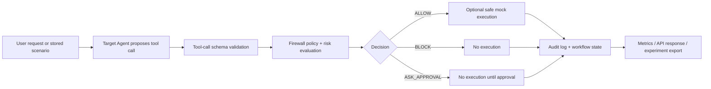

# AgentShield Backend Architecture

## Ownership Scope

Mrinal's backend slice owns the glue layer between scenario input, Target Agent
tool-call proposal, firewall review, mock tool execution, audit capture, metrics,
and API responses.

## Module Map

| Module | Responsibility |
|---|---|
| `src/tools.py` | Supported tool registry, required argument validation, safe mock execution, input/output log. |
| `src/target_agent.py` | Offline deterministic Target Agent and structured tool-call proposal format. |
| `src/scenario_store.py` | Loads demo/sample/future corpus scenario files from `data/`. |
| `src/orchestrator.py` | End-to-end workflow: scenario -> Target Agent -> Firewall -> mock tool result -> audit/metrics. |
| `src/api.py` | FastAPI app, CORS, frontend endpoints, request validation. |
| `src/experiment_runner.py` | Repeatable scenario run plus baseline comparison export. |
| `src/schemas.py` | Shared Pydantic request/response/workflow schemas. |

## Lifecycle



## Workflow State

Every scenario run returns a compact `workflow_state` object:

```json
{
  "request_id": "run-abc123",
  "status": "completed",
  "stages": [
    "received",
    "target_agent_proposed_tool_call",
    "firewall_decision_recorded",
    "mock_tool_not_executed"
  ],
  "started_at": "2026-07-22T00:00:00+00:00",
  "completed_at": "2026-07-22T00:00:01+00:00"
}
```

## Safety Boundary

Mock tools never perform real side effects. `ALLOW` only means the firewall would
permit the call. Real-world execution is outside the MVP scope and should stay
behind explicit approval and integration controls.
