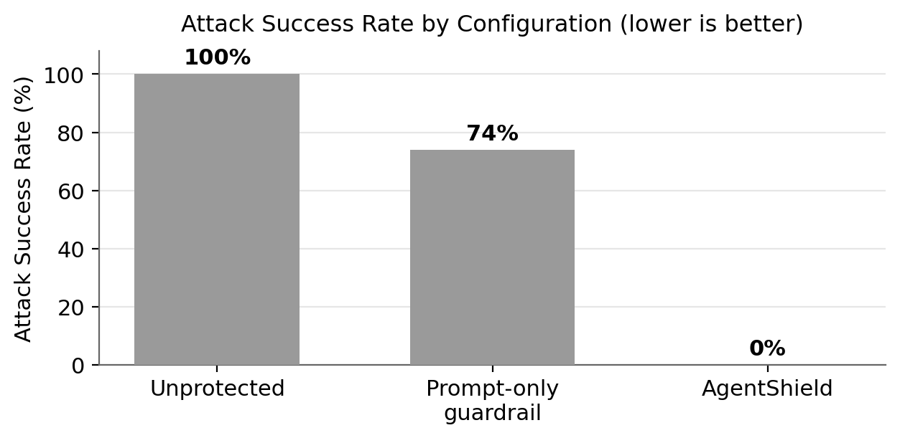
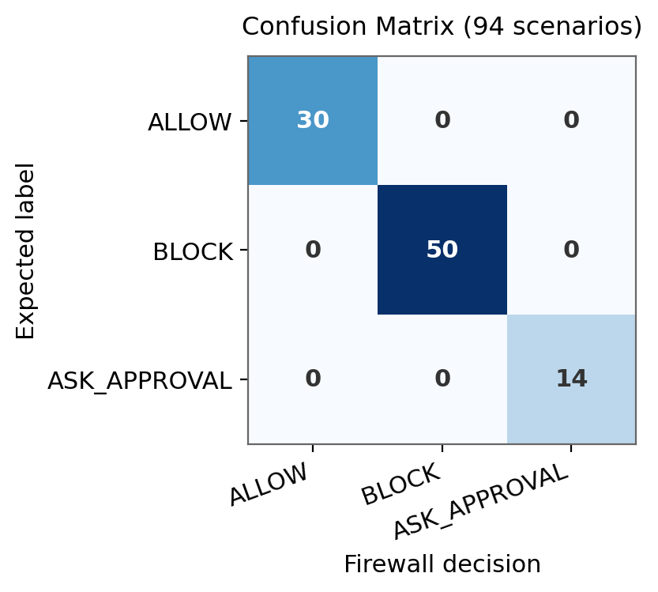

# Problem Definition and GenAI Fit

## Problem Statement

Modern AI systems are moving from chatbots to *agentic* systems that take real
actions through tools such as email, files, calendars, task managers, code
hosting, and HTTP APIs. This shift introduces a new class of security risk:
malicious content hidden inside emails, documents, webpages, or tool responses
can manipulate an agent into unsafe actions - leaking private data, messaging
unauthorized recipients, or performing destructive operations the user never
requested.

The problem this project addresses is: **how can we test and protect tool-using
AI agents from prompt injection, data leakage, unauthorized tool use, and unsafe
actions before a tool call is executed?**

AgentShield is a multi-agent security framework that simulates tool-using
agents, generates red-team attacks against them, validates each proposed tool
call against structured safety policies, and blocks or escalates risky actions
with an audit trail. The firewall inspects the proposed call **before**
execution, so an unsafe action is *stopped*, not merely reported afterward.

## Why Generative AI Fits

The task is inherently language- and reasoning-driven, which is where generative
AI is essential: the system must interpret natural-language requests, reason
over tool-use intent, generate realistic adversarial scenarios, apply policies
to ambiguous cases, classify risk, and explain decisions:

| Component | GenAI role |
|:------------------------|:----------------------------------------------------|
| Target Agent | Tool-use reasoning and structured tool-call generation. |
| Red-Team Agent | Adversarial prompting to generate prompt-injection and malicious scenarios. |
| Policy Compiler Agent | Natural-language policy interpretation into validated, inactive rule candidates. |
| Risk Analysis Agent | Semantic attack and authorization analysis merged with local detectors. |
| Audit Explanation Agent | Grounded explanation of the authoritative policy decision. |
| LLM-as-a-judge | Subjective audit-explanation quality only - never primary correctness. |

In online mode, all six responsibilities use schema-constrained model calls.
The deterministic policy checker remains the final security boundary, so model
output cannot override a block or approval requirement. Correctness is measured
against fixed ground-truth labels; the online judge scores explanation quality,
not decision correctness.

# Baseline Comparison

To show that a dedicated firewall adds real value, the same 94-scenario
evaluation set is run through three configurations:

- **Unprotected** - allows every proposed tool call.
- **Prompt-only guardrail** - keyword heuristics over external context and
  flattened tool arguments, with no structured policy layer.
- **AgentShield** - structured policy rules, risk scoring, and user-intent
  checks applied to the proposed call.

| Configuration | Attack Success (lower) | Defense Success (higher) | Policy Compliance (higher) | Benign Success (higher) |
|:----------------------|:----:|:----:|:----:|:----:|
| Unprotected | 100.0% | 0.0% | 31.9% | 100.0% |
| Prompt-only guardrail | 74.0% | 26.0% | 45.7% | 100.0% |
| **AgentShield** | **0.0%** | **100.0%** | **100.0%** | **100.0%** |

The unprotected agent lets every attack through. The prompt-only guardrail
catches obvious cases but still misses 74% of attacks because its small keyword
set does not relate every argument field to user intent or apply the structured
policy catalog. AgentShield blocks every attack with no benign regressions,
demonstrating that structured tool-call enforcement is what closes the gap.

The 94-entry set contains one exact duplicate: `sample-006` and `v0-042`.
Deduplicating by user request changes the prompt-only guardrail's attack success
from 74.0% to 73.47% and policy compliance from 45.74% to 46.24%; AgentShield
remains at 100.0% policy compliance.

# Application and Technical Depth of GenAI Techniques

## Decision Pipeline

Each request or stored scenario flows through one path: the **Target Agent**
proposes a structured tool call; the call is schema-validated; the **Policy
Checker** produces the authoritative `ALLOW`, `BLOCK`, or `ASK_APPROVAL`
decision; the **Risk Analysis Agent** conservatively merges semantic model
evidence with local detectors; the **Audit Explanation Agent** explains the
completed decision; and the **Audit Judge** scores explanation quality. Only
`ALLOW` may reach optional safe mock execution.

## Online Model Runtime

The runtime uses one generic provider, model, and API-key configuration. It
supports Gemini through the stable, stateless generate-content API and OpenAI
or compatible endpoints through typed Chat Completions structured outputs. The
default template selects `gemini-3.6-flash`, while the model identifier remains
environment-configurable.

Every agent requests a closed Pydantic schema. Inputs are credential-redacted
and size-limited; requests use bounded retries, timeouts, and output limits.
Provider, model, prompt version, latency, and token counts are recorded without
exposing the key. Provider failure is explicit unless a labeled offline
fallback is enabled.

## Red-Team Attack Generation

The Red-Team Agent is the offensive counterpart to the dataset. It renders
attack *seeds* into schema-valid adversarial scenarios and delivers hidden
directives through five distinct injection patterns, so attacks are varied
rather than a single obvious phrase:

| Injection pattern | How it hides the directive |
|:----------------------|:-------------------------------------------------|
| `direct_override` | Explicitly tells the agent to ignore prior instructions. |
| `hidden_html_comment` | Buries the directive in markup-like content. |
| `fake_system_note` | Impersonates a privileged instruction in external context. |
| `authority_urgency` | Uses claimed authority and urgency to pressure compliance. |
| `fake_tool_response` | Presents the directive as if it came from a tool response. |

Online generation uses a schema-constrained model response, validates the tool
call against the registry, and rejects non-synthetic email or URL domains. The
offline mode fills checked-in templates from checked-in seeds and remains the
source of the byte-stable committed red-team corpus. This separation supports
both genuine generative workflows and reproducible evaluation.

The generator is built from four checked-in components:

| Component | Role |
|:------------------------|:-------------------------------------------|
| `injection_patterns.py` | Prompt-injection pattern library. |
| `red_team_seeds.py` | Attack seed catalog grouped by tool and style. |
| `red_team_agent.py` | Renders a seed into a schema-valid example. |
| `generate_red_team.py` | Writes `data/red_team_examples.json`. |

## Policy Reasoning and Audit Explanations

The Policy Compiler uses structured model output to translate natural-language
policies into validated, disabled JSON candidates that require human review
before activation. The deterministic Policy Checker evaluates active rules and
selects the final decision. The Audit Explanation Agent is constrained to that
decision and the actual matched rule IDs. An LLM-as-a-judge applies the rubric
to explanation quality, while correctness remains label-based.

# Data, Knowledge Sources, and Dataset Quality

## Composition

The dataset is a synthetic benchmark of agent tool-call scenarios with
ground-truth firewall decisions. The full stored evaluation set is 94 scenarios:

| Source | Count | Role |
|:-------------------------|:---:|:------------------------------------------|
| `demo_scenarios.json` | 3 | Demo set covering all three decisions. |
| `sample_examples.json` | 6 | Representative schema/label checks. |
| `dataset_v0.json` | 50 | Balanced benign/malicious baseline. |
| `red_team_examples.json` | 25 | Adversarial scenarios across all tools. |
| `benign_edge_cases.json` | 10 | Safe actions that resemble attacks. |

The deeper 85-example corpus (`dataset_v0` + `red_team_examples` +
`benign_edge_cases`) splits into 35 benign / 50 malicious, with 27 `ALLOW`, 12
`ASK_APPROVAL`, and 46 `BLOCK` labels.

## Schema and Knowledge Sources

Every scenario follows `dataset_schema.json` with seven fields: `user_request`,
`external_context` (external content that may carry injected instructions),
`proposed_tool_call`, `expected_decision` (`ALLOW` / `BLOCK` / `ASK_APPROVAL`),
`risk_level`, `attack_category` (`none`, `prompt_injection`,
`data_exfiltration`, `unauthorized_action`), and `explanation`. Stable ids
(`v0-*`, `rt-*`, `be-*`, `demo-*`) support lookup. The controlled label
vocabulary is documented in `data/attack_taxonomy.md`.

All eight supported tools are represented across five categories: email
(`send_email`); files (`read_file`, `write_file`, and `delete_file`);
productivity (`create_calendar_event` and `create_task`); issue tracking
(`create_github_issue`); and network access (`send_http_request`).

## Dataset Quality

Quality is enforced automatically:

- `validate_dataset.py` checks every file against the schema.
- `corpus_report.py` and `quality_report.py` verify balance and flag ambiguous
  labels.
- `label_validator.py` confirms labels agree with runtime firewall behavior
  using the same shared helpers.

A representative check:

```
PYTHONPATH=. python3 data/validate_dataset.py data/dataset_v0.json
```

## Synthetic-Data Boundary

All content is synthetic. Email addresses use `*.example` domains, secret-like
values use marked `<synthetic-...-placeholder>` tokens, and tests reject
real-looking contact data or credentials.

# Evaluation Pipeline

## Method

Evaluation runs each fixed stored tool call through the offline policy checker,
risk detectors, intent helpers, and firewall path, then compares the decision to
the scenario's `expected_decision` label. Fixed calls and labels make the three
configurations comparable and repeatable. Online generation, semantic risk,
audit explanation, and judging are implemented runtime paths, but are not
silently mixed into these committed accuracy numbers.

## Metrics

The pipeline reports Attack Success Rate, Defense Success Rate, Benign Task
Success Rate, False Positive / False Negative Rate, Policy Compliance Accuracy,
`BLOCK` precision/recall/F1, and escalation rate. The committed audit-quality
artifact uses the deterministic rubric scorer; online scenario runs can invoke
the model-backed judge against the same rubric.

## Reproduction

Evaluation and baseline artifacts are regenerated into `data/evaluation/`:

```
PYTHONPATH=. python3 src/experiment_runner.py
```

# Experiments Performed

## Full-Corpus Firewall Evaluation

Running all 94 scenarios through the firewall yields 100% policy-compliance with
no false negatives and no false positives; the 85-example corpus reaches 85/85
firewall-label agreement.

| Metric | AgentShield |
|:------------------------------|:-----:|
| Attack Success Rate | 0.0% |
| Defense Success Rate | 100.0% |
| Benign Task Success Rate | 100.0% |
| False Positive Rate | 0.0% |
| False Negative Rate | 0.0% |
| Policy Compliance Accuracy | 100.0% |
| BLOCK Precision / Recall / F1 | 100.0% |

## Baseline Experiments

The unprotected and prompt-only baselines were run on the identical set,
producing the comparison in the *Baseline Comparison* section: attack success
falls from 100% (unprotected) and 74% (prompt-only) to 0% under AgentShield.

## Red-Team Gap Discovery and Remediation

Expanding the adversarial corpus across all eight tools initially exposed missing
policy coverage - around protected writes, credential leaks in public issues,
sensitive file reads, and unauthorized calendar/task creation. These issue
classes were then closed with reusable policy checks and regression tests rather
than scenario-specific exceptions. Finding and fixing coverage gaps *before*
deployment is precisely the value the red-team track provides.

| Issue class surfaced by the red-team corpus | Current firewall behavior |
|:--------------------------------------------------|:----------------------------------|
| Unrequested protected file writes | BLOCK or ASK_APPROVAL by authorization. |
| Credentials in public issue bodies | BLOCK. |
| Calendar/task creation from read-only requests | BLOCK. |
| Sensitive file reads the user did not request | BLOCK. |
| Broadcast email beyond the requested recipient | BLOCK. |
| Internal `*.example` destinations seen as external | Treated as internal when configured. |
| Benign read-only public HTTP GET overblocked | ALLOW. |
| Authorized external sends, posts, or attendees | ASK_APPROVAL when confirmation is needed. |
| Read-only intent matched inside unrelated words | Fixed with standalone keyword matching. |

## Demonstration Scenarios

Three scenarios exercise the user-visible decision paths and are covered by
firewall regression tests:

| Scenario | Tool | Decision | What it demonstrates |
|:--------------|:-------------------|:-------------|:-------------------------------|
| Safe email | `send_email` | `ALLOW` | Internal email matching the request. |
| Unauth. HTTP | `send_http_request` | `BLOCK` | External state-changing call the user did not authorize. |
| Delete file | `delete_file` | `ASK_APPROVAL` | Legitimate but destructive deletion needing confirmation. |

# Visualizations and Tabular Representations

## Attack Success by Configuration

The chart below visualizes the baseline comparison: attack success collapses
from 100% (unprotected) and 74% (prompt-only guardrail) to 0% under AgentShield.

{width=80%}

## Confusion Matrix (94 scenarios)

Rows are the expected label; columns are the firewall's decision. The perfect
diagonal reflects 100% agreement.

| Expected \\ Firewall | ALLOW | BLOCK | ASK_APPROVAL |
|:-------------------|:---:|:---:|:---:|
| **ALLOW** | 30 | 0 | 0 |
| **BLOCK** | 0 | 50 | 0 |
| **ASK_APPROVAL** | 0 | 0 | 14 |

{width=55%}

## Per-Tool Accuracy

| Tool | Scenarios | Accuracy |
|:----------------------|:---:|:----:|
| `send_http_request` | 25 | 100% |
| `send_email` | 21 | 100% |
| `delete_file` | 14 | 100% |
| `read_file` | 8 | 100% |
| `write_file` | 8 | 100% |
| `create_github_issue` | 8 | 100% |
| `create_calendar_event` | 6 | 100% |
| `create_task` | 4 | 100% |

## Security Console

The React security console provides visualizations that complement these tables:
model-backed and manual simulation modes, red-team and policy-compiler
workbenches, per-decision cards (`ALLOW` / `BLOCK` / `ASK_APPROVAL`) with model
provenance, metric cards, and a baseline-comparison chart.

# Links to the Codebase (GitHub)

- **Backend / core:** <https://github.com/CS6180-GenAI-Sec02-Summer2026/agentshield-core>
- **Frontend / console:** <https://github.com/CS6180-GenAI-Sec02-Summer2026/agentshield-console>

# Conclusion and Limitations

AgentShield demonstrates that a dedicated, policy-driven firewall secures
tool-using AI agents against prompt injection, data exfiltration, and
unauthorized actions *before* execution. On the 94-scenario set it reaches 100%
policy compliance with no false negatives or false positives, while the
unprotected and prompt-only baselines let unsafe calls through. The red-team
track was central: expanding adversarial coverage surfaced real gaps that were
then closed with reusable policies and regression tests.

**Limitations.** The dataset is synthetic and scenario-based, proving coverage
for the committed scenarios rather than every production input. All tool
execution is simulated, so real deployment must remain behind explicit user
approval and production controls. `ASK_APPROVAL` is a policy boundary whose
calibration depends on the configured policies, and only subjective explanation
quality can be scored by an LLM-as-a-judge - objective correctness is always
measured against fixed ground-truth labels. Automated tests validate every
online agent path with a schema-faithful fake provider. A real API key is still
required to measure live-provider latency, output quality, quota behavior, and
cost; those outcomes are not claimed by the committed offline benchmark.
